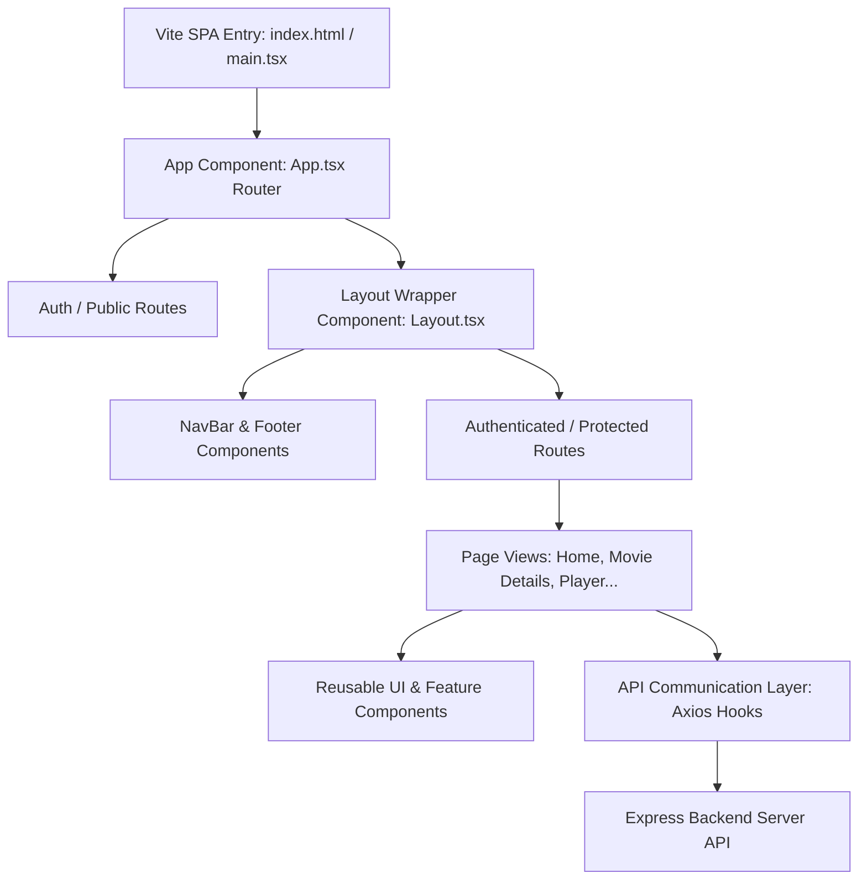

# FilmLane Frontend Client

Welcome to the frontend architecture and high-level design specification of **FilmLane**, a premium movie and TV show discovery platform. This client application is a modern Single Page Application (SPA) built with React, Vite, and Tailwind CSS v4.

---

## 🏛️ 1. Overall Architecture

The FilmLane client is structured as a component-driven Single Page Application (SPA). It uses a clean separation of concerns, separating presentation, logic, routing, and data-fetching:



### Key Technical Specs:
- **Core Framework:** React 19
- **Build Tool & Bundler:** Vite with TypeScript integration
- **Styling Engine:** Tailwind CSS v4 (configured via `@tailwindcss/vite` plugin)
- **Icons:** React Icons & Heroicons
- **Routing:** React Router DOM v7
- **Form State & Validation:** React Hook Form
- **Network Requests:** Axios & Axios-Hooks

---

## 🎴 2. Application Layout

The user interface follows a clean, responsive layout designed for multi-device compatibility (Desktop, Tablet, Mobile).

### 🖥️ Main Application Layout (`Layout.tsx`)
```text
+-----------------------------------------------------------------------------------+
|  [Logo]   Home   Movies   TV Shows   Top IMDb   [ Search Movies... ]    [Profile] | <-- Navigation Bar
+-----------------------------------------------------------------------------------+
|                                                                                   |
|                                                                                   |
|                                     Hero Banner                                   |
|                                                                                   |
|                                                                                   |
+-----------------------------------------------------------------------------------+
|                                                                                   |
|  [ Trending Carousel ]                                                            |
|  [ < ]  [Card]  [Card]  [Card]  [Card]  [Card]  [Card]  [Card]  [Card]  [ > ]       |
|                                                                                   |
|  [ Popular Movies Grid ]                                                          |
|  +--------------+  +--------------+  +--------------+  +--------------+           |
|  | Movie Poster |  | Movie Poster |  | Movie Poster |  | Movie Poster |           |
|  +--------------+  +--------------+  +--------------+  +--------------+           |
|                                                                                   |
+-----------------------------------------------------------------------------------+
|  © 2026 FilmLane. All rights reserved.                   [About] [Terms] [Contact]| <-- Footer
+-----------------------------------------------------------------------------------+
```

### 👤 Onboarding Layout (Public / Authenticated Pages)
- **Landing Screen:** Clear layout with a background grid of movie posters, a primary headline call-to-action (CTA), and quick paths to Login / Register.
- **Login / Register Screen:** Minimalist, centered glassmorphic card container with validation messages, inputs, and submit states.

---

## 🗺️ 3. Page Hierarchy

```text
client/src/pages/
├── LandingPage/             # Path: "/" - Splash screen & onboarding call-to-action
├── LoginPage/               # Path: "/login" - Credentials-based login
├── Register/                # Path: "/register" - Registration with match validation
├── Homepage/                # Path: "/home" - Movie carousels, hero sliders, trending content
├── MovieDetails/            # Path: "/movies/:movieId" - Poster, cast, trailers, recommendations
├── MoviePlay/               # Path: "/movies/:movieId/play" - Embedded video player & watch progress
├── TvDetails/               # Path: "/tv/:tvId" - Season selection & episode lists
├── TvEpisodePlay/           # Path: "/tv/:tvId/season/:season_number/episode/:episode_number" - Episode player
├── SearchPage/              # Path: "/search" - Dynamic multi-search results list
├── UserProfile/             # Path: "/profile" - Edit profile details, watchlist grid, and history logs
└── PageNotFound/            # Path: "*" - Catch-all 404 handler page
```

---

## 🧱 4. Component Hierarchy

To maintain reusable, modular, and maintainable code, components are organized as follows:

```text
client/src/components/
├── Layout/
│   ├── Layout.tsx           # Global site container wrapping Outlet with NavBar & Footer
│   ├── NavBar/              # Sticky header with logo, navigation links, and User dropdown
│   └── Footer/              # Site map, legal links, and social icons
├── ui/                      # Base Design System atomic components (stateless UI elements)
│   ├── Button.tsx           # Buttons (primary, secondary, danger, icon)
│   ├── Input.tsx            # Styled inputs with form-hook wrappers
│   ├── Badge.tsx            # Small badges for ratings, quality (HD), or status
│   ├── Modal.tsx            # Generic overlay modal containers
│   ├── Spinner.tsx          # Loading spinners
│   └── Skeleton.tsx         # Skeleton placeholders for content loading state
└── features/                # Domain-specific interactive components
    ├── MediaCard.tsx        # Compact media card featuring poster, hover info, and watch status
    ├── MediaGrid.tsx        # Responsive grid layout wrapper for MediaCards
    ├── MediaCarousel.tsx    # Horizontal scrolling list of cards with left/right navigations
    ├── HeroSlider.tsx       # Main page promotional carousel with backdrop images and quick play actions
    ├── FilterBar.tsx        # Dropdowns and sort controls (Genre, Release Year, Popularity)
    ├── WatchlistButton.tsx  # Interactive bookmark button with sync to server DB
    └── VideoPlayer.tsx      # Customized iframe or HTML5 player with user watch history updates
```

---

## 🔄 5. Data Flow

Data flow follows a unidirectional path down the component tree. Interactions and mutations trigger API calls that update the local state or context:

```text
+-----------------------+
|  User Interactions    |  (e.g., Click 'Add to Watchlist')
+-----------+-----------+
            |
            v
+-----------------------+
|   Event Handlers      |  (Calls API service functions)
+-----------+-----------+
            |
            v
+-----------------------+
|   Communication Layer |  (Axios Request dispatched to express server)
+-----------+-----------+
            |
            v
+-----------------------+
|    Server Response    |  (Server returns updated user state)
+-----------+-----------+
            |
            v
+-----------------------+
|   State Update (Auth) |  (Updates React context & UI state)
+-----------+-----------+
            |
            v
+-----------------------+
|   UI Re-renders       |  (Watchlist button changes state to bookmarked)
+-----------------------+
```

---

## 💾 6. State Management

The application segregates state into three main tiers:

### 1. Global State (`AuthContext`)
Uses React Context to store application-wide data:
- **`user`**: Stores current authenticated user's ID, username, and email.
- **`isAuthenticated`**: Boolean flag indicating if the session is valid.
- **`watchlistCount`**: Live count of items in the user's bookmark list.
- **Actions:** `login()`, `logout()`, `updateUserProfile()`.

### 2. Server State (Caching & Queries)
Managed via `axios-hooks` to handle network requests efficiently:
- Automatically tracks **`loading`**, **`error`**, and **`data`** state.
- Controls data refetching strategies on UI transitions (e.g. when updating items).

### 3. Local/UI State
Handled with standard React hooks (`useState`, `useRef`):
- Modal open/close flags.
- Slider transition indexes.
- Search query typing buffers (input focus, query values).
- Filter dropdown states.

---

## 🚦 7. Routing

Routing and route protection are configured dynamically via React Router:

| Path | Element | Access Control |
|---|---|---|
| `/` | `<LandingPage />` | Public (Redirects to `/home` if already logged in) |
| `/login` | `<LoginPage />` | Public (Redirects to `/home` if already logged in) |
| `/register` | `<Register />` | Public (Redirects to `/home` if already logged in) |
| `/home` | `<HomePage />` | Protected (Redirects to `/login` if unauthenticated) |
| `/movies` | `<MovieDiscovery />` | Protected |
| `/movies/:movieId` | `<MovieDetails />` | Protected |
| `/movies/:movieId/play` | `<MoviePlay />` | Protected |
| `/tv` | `<TvDiscovery />` | Protected |
| `/tv/:tvId` | `<TvDetails />` | Protected |
| `/tv/:tvId/season/:s/episode/:e`| `<TvEpisodePlay />` | Protected |
| `/search` | `<SearchPage />` | Protected |
| `/profile` | `<UserProfile />` | Protected |
| `*` | `<NotFound />` | Catch-All Public |

---

## 📡 8. Communication Layer

The frontend talks to the backend server API via a configured Axios client instance:

### Axios Base Setup
Instantiated inside `src/App.tsx` and exported/configured:
```typescript
import axios from 'axios';

export const api = axios.create({
  baseURL: import.meta.env.VITE_API_BASE_URL || 'http://127.0.0.1:3000/api/',
  withCredentials: true, // Enables cookie passing for session persistence
  headers: {
    'Content-Type': 'application/json',
  }
});
```

### Interceptors
- **Request Interceptor:** Dynamically appends tokens or locale/language headers when proxying to TMDB.
- **Response Interceptor:** Checks for `401 Unauthorized` responses and automatically deletes client session cookies, updates `AuthContext` to null, and redirects the user to the log-in page.
